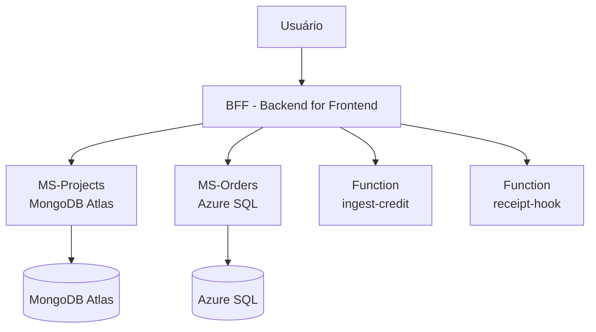
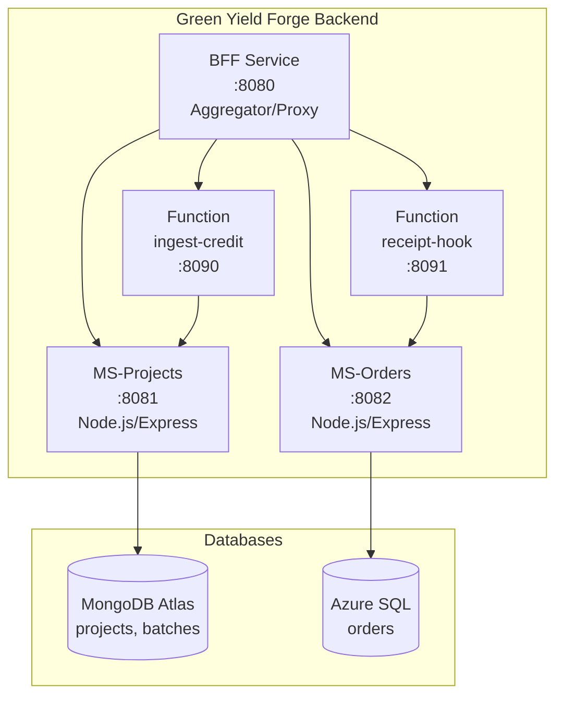
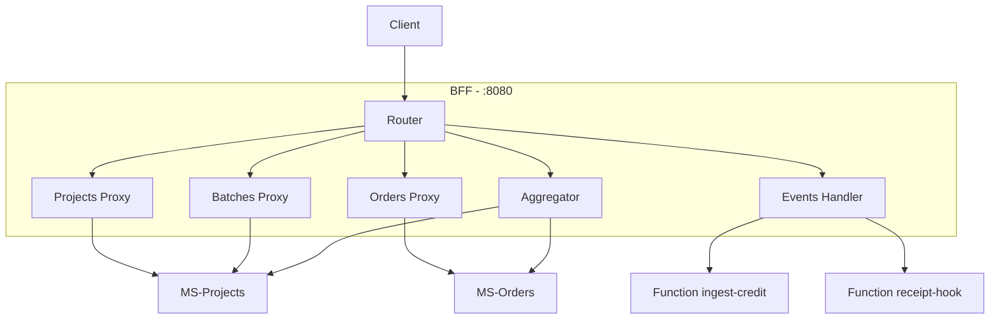

# Diagramas C4 - Green Yield Forge Backend

## C1 - Contexto do Sistema

```mermaid
graph TB
    User[Usuário]
    BFF[BFF - Backend for Frontend]
    
    User --> BFF
    
    BFF --> MSProjects[MS-Projects<br/>MongoDB Atlas]
    BFF --> MSOrders[MS-Orders<br/>Azure SQL]
    BFF --> FNIngest[Function<br/>ingest-credit]
    BFF --> FNReceipt[Function<br/>receipt-hook]
    
    MSProjects --> MongoDB[(MongoDB Atlas)]
    MSOrders --> SQL[(Azure SQL)]
```

## C2 - Contêineres

```mermaid
graph TB
    subgraph "Green Yield Forge Backend"
        BFF[BFF Service<br/>:8080<br/>Aggregator/Proxy]
        MSProjects[MS-Projects<br/>:8081<br/>Node.js/Express]
        MSOrders[MS-Orders<br/>:8082<br/>Node.js/Express]
        FNIngest[Function<br/>ingest-credit<br/>:8090]
        FNReceipt[Function<br/>receipt-hook<br/>:8091]
    end
    
    subgraph "Databases"
        MongoDB[(MongoDB Atlas<br/>projects, batches)]
        SQL[(Azure SQL<br/>orders)]
    end
    
    BFF --> MSProjects
    BFF --> MSOrders
    BFF --> FNIngest
    BFF --> FNReceipt
    
    MSProjects --> MongoDB
    MSOrders --> SQL
    
    FNIngest --> MSProjects
    FNReceipt --> MSOrders
```

## C3 - Componentes do BFF

```mermaid
graph TB
    subgraph "BFF - :8080"
        Router[Router]
        ProjectsProxy[Projects Proxy]
        BatchesProxy[Batches Proxy]
        OrdersProxy[Orders Proxy]
        EventsHandler[Events Handler]
        Aggregator[Aggregator]
    end
    
    Client[Client]
    MSProjects[MS-Projects]
    MSOrders[MS-Orders]
    FNIngest[Function ingest-credit]
    FNReceipt[Function receipt-hook]
    
    Client --> Router
    Router --> ProjectsProxy
    Router --> BatchesProxy
    Router --> OrdersProxy
    Router --> EventsHandler
    Router --> Aggregator
    
    ProjectsProxy --> MSProjects
    BatchesProxy --> MSProjects
    OrdersProxy --> MSOrders
    EventsHandler --> FNIngest
    EventsHandler --> FNReceipt
    Aggregator --> MSProjects
    Aggregator --> MSOrders
```

